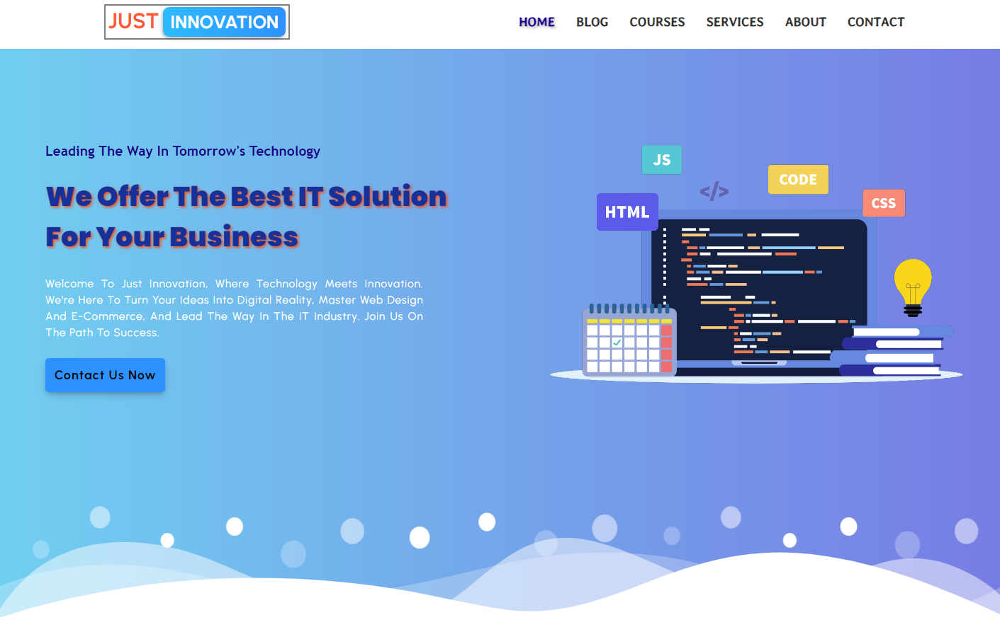

# Software House Website

This project is my first full website created solely using HTML and CSS. It's designed for a IT, Tech or company software house and comprises five main pages: Home, Blog, Courses, Services, and Contact.

## Preview

## Features

- **Pages:**
  - Home: Introduction to the software house, highlighting its core features.
  - Blog: Articles and updates related to the industry or company news.
  - Courses: Information about available courses or learning resources.
  - Services: Details about the services offered by the software house.
  - Contact: Ways to get in touch with the team.
  - 404 Page: 404 error page that redirects users when a link is empty or not found.

- **404 Page:**
  - There's a custom 404 error page that redirects users when a link is empty or not found.
  - Please note, it's not fully functional at the moment, but it's a feature I plan to improve in the future.
    
- **Animations and Hover Effects:**
  - The website incorporates various hover effects and cool animations to enhance user interaction and visual appeal.
  - Animations are used for elements like cards, buttons, and transitions between pages.

- **Cards with Animations:**
  - Engaging and visually appealing cards are implemented throughout the website.
  - These cards include animations and hover effects to provide a dynamic user experience.

## Preview

<a href="https://codebyfaisal.github.io/project1.github.io/" target="_blank">Project Preview</a>

## Technologies Used

- HTML
- CSS

## How to Use

1. Clone this repository.
2. Open the respective HTML files in your preferred web browser.
3. Explore the different pages and interactions to experience the website.

## Future Improvements

- Incorporate JavaScript to add more interactive elements.
- Implement responsiveness for various screen sizes and devices.
- Enhance accessibility features for a better user experience.

Feel free to contribute or provide feedback!

If you have any questions or suggestions, please reach out.

Happy Coding! 🚀
